```{r setup, include=FALSE}
knitr::opts_chunk$set(echo = FALSE)
library("xaringanthemer")
# xaringan::summon_remark()
```

```{r xaringan-themer, include=FALSE, warning=FALSE}
# style_mono_accent(base_color = "#23395b")
style_duo_accent(primary_color = "#03A696", secondary_color = "#035AA6", header_font_google = google_font("Josefin Sans"), text_font_google   = google_font("Montserrat", "300", "300i"), code_font_google   = google_font("Fira Mono"), inverse_text_shadow = FALSE)
```

```{r xaringanExtra, echo=FALSE}
xaringanExtra::use_xaringan_extra(c("tile_view", "scribble"))
xaringanExtra::use_fit_screen()
xaringanExtra::use_panelset()
```

```{r, load_refs, include=FALSE}
# library("RefManageR")
# bib <- ReadBib("bib.bib", check = FALSE)
# pb <- function(key) {
#   TextCite(bib, key, .opts = list(
#     style = "markdown", 
#     hyperlink = "to.doc")
#     )
# }
```

layout: false

name: title
class: left, bottom
background-image: url("../figuras/title-slide.001.jpeg")
background-size: cover

.pull-left[

# .midlarge[.black[`r rmarkdown::metadata$title`]]

## .mid[.black[`r rmarkdown::metadata$subtitle`]]

#### .large[.black[`r rmarkdown::metadata$author` | `r rmarkdown::metadata$date`]]

]

<div class="cr cr-top cr-left cr-sticky cr-black">COVID19</div>

---

layout: true

<div class="cr cr-top cr-left cr-sticky cr-black">COVID19</div>

---

```{r, include = FALSE, eval = FALSE}
library("metathis")
meta() %>%
  meta_general(
    description = "Minicurso simplificado para produção de mapas de distribuição de espécies utilizando o ambiente R",
    generator = "xaringan e remark.js"
  ) %>% 
  meta_name("github-repo" = "ricoperdiz/plantintelligence") %>% 
  meta_social(
    title = "Plant intelligence",
    # url = "https://rstd.io/sharing",
    image = "https://raw.githubusercontent.com/ricoperdiz/plantintelligence/main/share-card.png?token=ACSZLRFRBETCEJ65HB2PQKLAL72RG",
    image_alt = "Primeiro slide mostra um mapa com pontos de ocorrência de espécies do complexo Protium aracouchini (Aubl.) Marchand, um grupo de árvores pequenas que ocorre na América do Sul",
    og_type = "website",
    twitter_card_type = "summary_large_image"
  )
```

class: middle, center, hide_logo
background-image: url("../figuras/who-am-i.001.jpeg")
background-size: cover


.pull-left[


### Sobre mim


  **Dr. em Botânica (INPA)**  
  **Analista de dados**  
  
  [`r icons::fontawesome("github")` @ricoperdiz](https://github.com/ricoperdiz)  
  [`r icons::fontawesome("twitter")` @ricoperdiz](https://twitter.com/ricoperdiz)  
  [`r icons::fontawesome("link")` ricardoperdiz.com](https://ricardoperdiz.com)  
  [`r icons::fontawesome("paper-plane")` ricoperdiz@gmail.com](mailto:ricoperdiz@gmail.com)  

]

???

Meu nome é Ricardo de Oliveira Perdiz. 
Sou um biólogo com mestrado e doutorado em botânica, minha linha de pesquisa é com a evolução e sistemática da flora Neotropical, em especial a família do palo santo, mirra, breus, e amesclas, conhecida pelo nome científico Burseraceae. Também me dedico à criação de ferramentas para facilitar a análise de dados taxonômicos e produção de monografias taxonômicas.

---

layout: true

<div class="cr cr-top cr-left cr-sticky cr-black">COVID19</div>

<a class="footer-link" href="https://github.com/ricoperdiz/minicurso-elaboracao-mapa-R">mapa-R</a>

---

# Sumário


## [Introdução](#introducao) básica ao R

--

## Tutorial para elaborar o mapa

--

### Carregar [pacotes](#pacotes)

--

### Importar [dados](#dados)

--

### Checagem e limpeza de [dados](#limpeza)

--

### Criação de [variáveis](#variaveis)

--

### [Plota](#plota) o mapa

---

## Versão simplificada do tutorial

### Carregar [pacotes](#pacotes)

### Importar [dados](#dados)

### .red[Checagem e limpeza de dados]

### Criação de [variáveis](#variaveis)

### [Plota](#plota) o mapa

???

Apresentarei uma versão simplificada do tutorial, SEM A CHECAGEM e LIMPEZA dos DADOS (RISCAR ESSA PARTE).

Caso haja tempo, eu explorarei essa parte amanhã.  

---
name: introducao
class: inverse, center, middle
# Introdução básica


???

Desejo agora explanar brevemente sobre o que é o R, e passar conhecimentos bem simplificados que são necessários para manipulação de dados em ambiente R.  

---

## O que é o R? 

> **R** é uma **linguagem** e **ambiente** para análise estatística e produção de gráficos de alta qualidade.

.center[
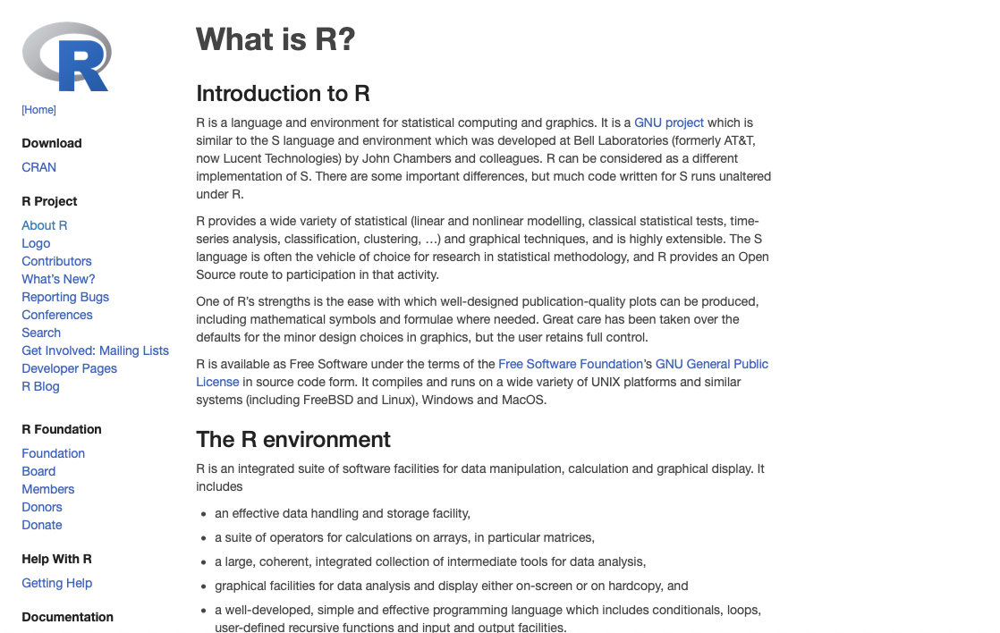
]

---

## O que é o R? 

> **R** pode ser utilizado para manipular e analisar dados, criar gráficos, e simulação computacional.

.center[
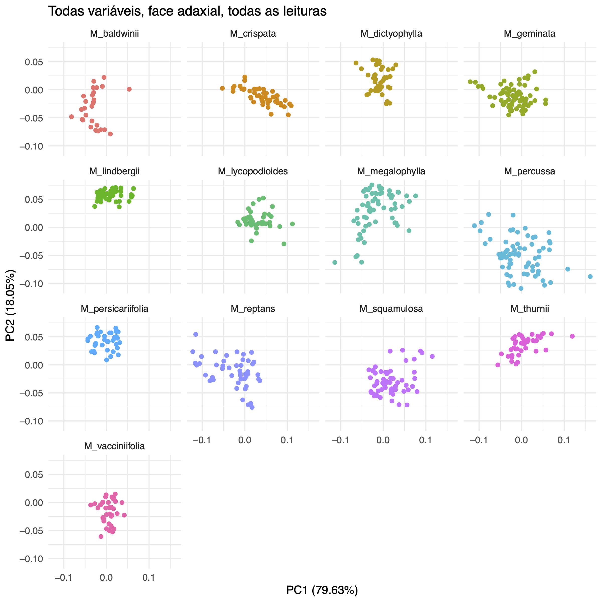
]

---

## O que é o R? 

> **R** pode ter extensão de funções através do uso de **[pacotes](https://www.cran.r-project.org/web/packages/)**, baixados por meio do **C**omprehensive **R** **A**rchive **N**etwork (**[CRAN](https://www.cran.r-project.org))**

.center[
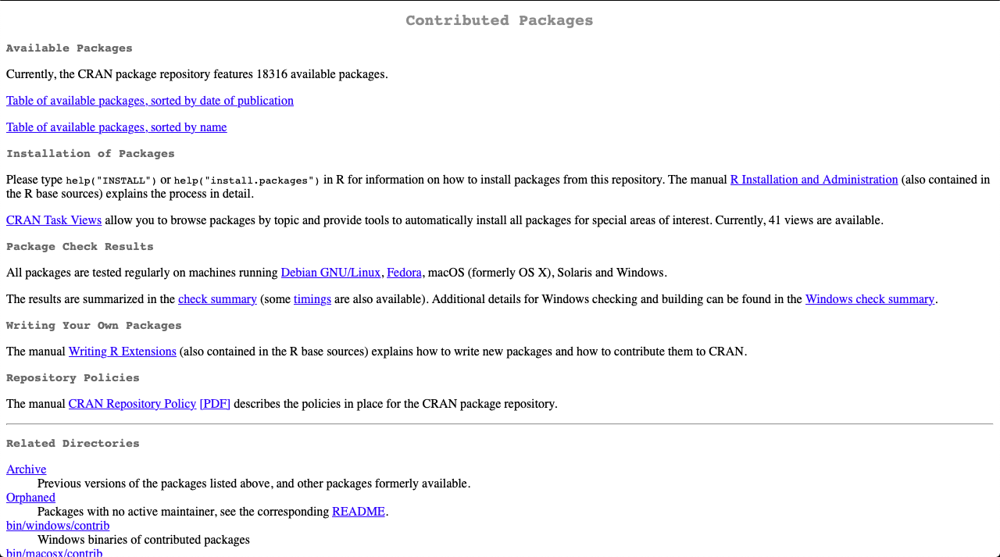
]

---

## Por que usar o R???

--

#### 1. É grátis

--

#### 2. Gráficos excelentes

--

#### 3. Diversidade de ferramentas (=pacotes) para fazer análises estatísticas

--

#### 4. Liberdade para criação de funções

---

### Como obter o R?

Visitar a página do projeto: [www.r-project.org](www.r-project.org).

--

Verificar este tutorial para instalação: [https://github.com/ricoperdiz/minicurso-elaboracao-mapa-R/blob/main/extra-ref/Instrucoes_ROPerdiz_instalando_Baixando_R.pdf](https://github.com/ricoperdiz/minicurso-elaboracao-mapa-R/blob/main/extra-ref/Instrucoes_ROPerdiz_instalando_Baixando_R.pdf).

---

## Qual é a cara do R? Mac OS

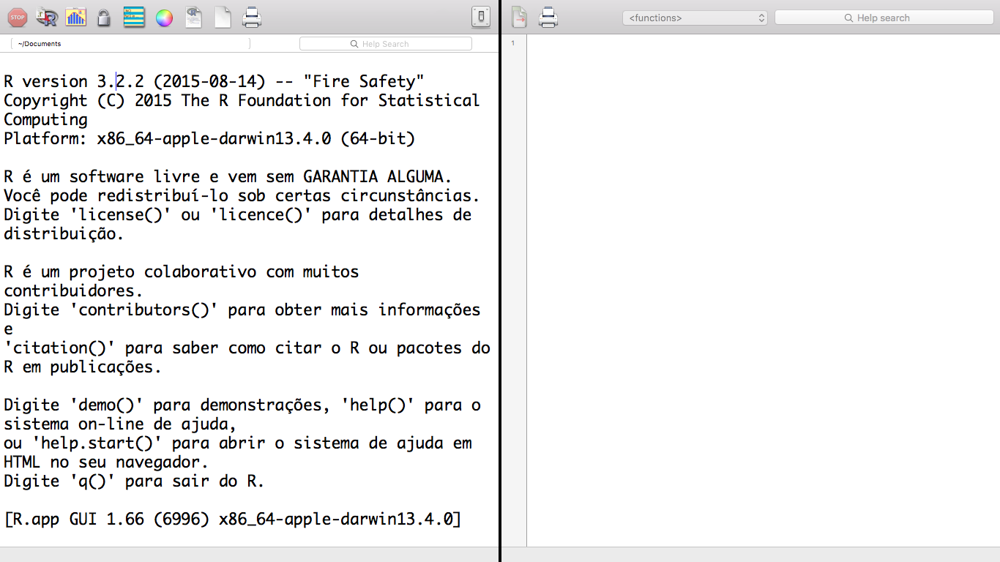

---

## Qual é a cara do R? Windows

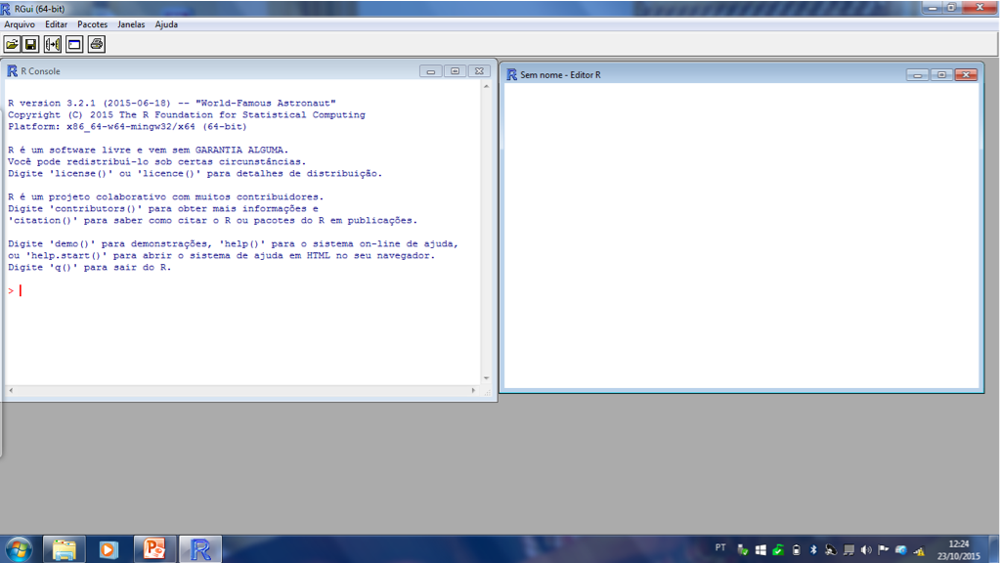

---

## Como é a linguagem do R

> "*Orientada a objetos*" - *object-oriented programming*


---

## Como é a linguagem do R

* Escrever em R é como escrever em português, inglês etc;

--

* Programar em linguagens como R consiste em definir *funções* e *variáveis*;

--

* *Variáveis* podem ser números ou palavras; guardamos esses valores para uso posterior;

--

* *Funções* executam comandos, por meio de *argumentos*;

--

* Comandos geram resultados.  

---

## R é calculadora!

```{r, echo=TRUE}
1 + 1
```

```{r, echo=TRUE}
resultado <- 22*3^2
77*resultado
```

---

### Variáveis

Variáveis em R são assinaladas utilizando a notação ` <- `.  

```{r, echo=TRUE}
meunome <- "Ricardo de Oliveira Perdiz"
idade <- 17
paste(meunome, "tem", idade, "anos")
```

---

### Mais exemplos

.panelset[
.panel[.panel-name[Código R]

```{r, echo = TRUE,prompt = TRUE}
string <- 'Olá, Itacoatiara!'
meu_numero <- 25
```
]

.panel[.panel-name[Resultado 1]

```{r, echo = TRUE,prompt = TRUE}
string
meu_numero
```
]

.panel[.panel-name[Resultado 2]

```{r, echo = TRUE,prompt = TRUE}
print(string)
print(meu_numero)
```
]
]

---

### Funções e argumentos

* **Função** -> é um elemento em R que requer uma ação do computador. Cumpre determinada tarefa.

--

* **Argumento** -> especifica ou modifica como uma função trabalha. É especificado dentro de "parênteses" após o nome da função

```{r, echo = TRUE, prompt = TRUE}
seq(from = 0,to = 10,by =1)
```

---

### Como é a linguagem do R

##### Anatomia de uma linha de comando

.panelset[
.panel[.panel-name[Código R]

```{r, echo = TRUE, prompt = TRUE}
x <-sample(1:10,20,replace=TRUE)
```

]

.panel[.panel-name[Código R 2]

```{r, eval = FALSE, echo = TRUE, prompt = TRUE}
x <- sample(1:10, 20, replace = TRUE)
```

]

.panel[.panel-name[O que tem em x?]

```{r, echo = TRUE,prompt = TRUE}
print(x)
```

]

.panel[.panel-name[Média de x]

```{r, echo = TRUE,prompt = TRUE}
mean(x)
```

]

]

---

### Detalhes *nomenclaturais* em R

* Separador de decimal é ponto (= "."); vírgula separa **argumentos**

--

* O símbolo de *igual* "=" atribui valores aos **argumentos**

--

* Nomes de **argumentos** podem ser omitidos, desde que os valores estejam seguindo a ordem pré-determinada da função. Ver o '?help'

--

* Aspas guardam texto; parênteses servem para abrir e fechar funções ou vetores; nomes de objetos não podem ter espaços nem símbolos especiais.  

---

### O meu melhor amigo é o **?** (ou a ajuda do R!)

Ter dúvidas é comum ao programar.  

--

O R possui um excelente recurso, o `?` (ajuda, ou "help").  

--

Uma das maneiras é digitar "?" + "*nomeDaFunção*".  

```{r, eval=FALSE, echo=TRUE}
?seq
```

---

### O meu melhor amigo é o **?** (ou a ajuda do R!)

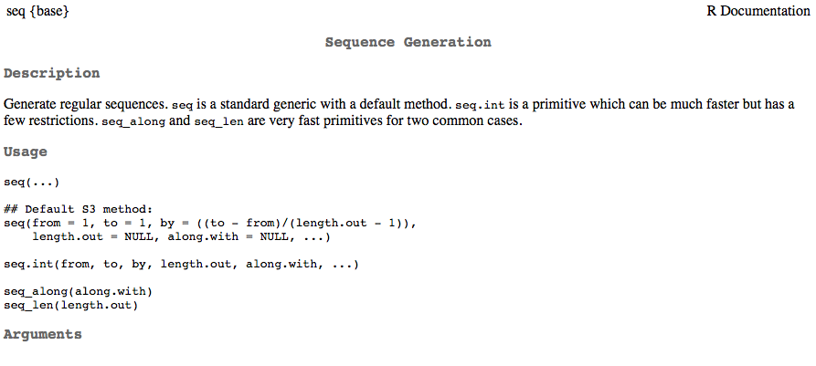

---

### Viva o poder da linguagem R

.panelset.sideways[
.panel[.panel-name[Gráfico 1]
```{r echo=FALSE}
plot(cars)
```
]

.panel[.panel-name[Gráfico 2]

```{r echo=FALSE}
x <- c(1,3,6,9,12)
y <- c(1.5,2,7,8,15)
plot(x,y, xlab="x axis", ylab="y axis", main="NOSSO PLOT", ylim=c(0,20), xlim=c(0,20), pch=15, col="blue",cex=1.2)
myline.fit <- lm(y ~ x)
abline(myline.fit)
```
]

.panel[.panel-name[Mapas em R com `maps`]

```{r, echo=F, cache=TRUE, fig.width=12, fig.height=8}
library("maps")
library("RColorBrewer")
cpa <- read.table("dados/cpa_praUnir_comspnov_02.csv",header = TRUE,as.is = TRUE,sep='\t')
cpa <- cpa[order(cpa$SP),]
spp <- unique(cpa$SP)
cores.map <- brewer.pal(length(spp),name='Paired')
cores.map <- cores.map[c(1,5,2,6,3,7,4,8)]
cores.map[1] <- 'black'
y1 <- range(cpa$Latitude) + c(-2,4)
x1 <- range(cpa$Longitude) + c(-2,2)
pontos <- rev(c(7,10,12,21:25))
posicoes <- seq(-45,-37.5,2.5)
v.cex = seq(0.8,1.1,0.1)
val.exp <- as.numeric(as.factor(as.data.frame(table(cpa$SP))[,2]))
cex.ponto <- seq(1.8,0.8,length.out=max(val.exp))
paises <- c('Brazil','Argentina','Peru','Paraguay','Ecuador','Chile','Uruguay','French Guiana','Suriname','Venezuela','Colombia','Guyana','Bolivia','Panama','Costa Rica')
maps::map(regions=paises,col='gray95',fill = TRUE,xlim=x1,ylim=y1) 
abline(h=0,lwd=0.5,lty="dotted")
for(i in 1:length(spp)){
  points(cpa$Longitude[cpa$SP==spp[i]],cpa$Latitude[cpa$SP==spp[i]], pch=pontos[i],col=cores.map[i],bg=cores.map[i],cex=cex.ponto[val.exp[i]])
}
par(cex=1, las=1)
map.scale(-55,ratio=F,cex=1.2)
map.axes()
axis(side=4,las=1)
axis(side=3,las=1)
legend(posicoes[2],11.5,legend=spp,pch=pontos,col=cores.map,pt.bg=cores.map,cex=1.2,x.intersp=0.4,text.font=3)
```

]

.panel[.panel-name[Mapas em R com `tmaps`]
```{r, cache=TRUE, fig.width=12, fig.height=8}
library("tmap")
data(World)
qtm(World, fill = "life_exp")
```
]

.panel[.panel-name[Mapas em R com `ggmap`]
```{r, cache=TRUE, eval=FALSE, fig.width=12, fig.height=8, message=FALSE,warning=FALSE}
library("ggmap")
chave <- Sys.getenv("GGMAP_KEY")
register_google(key = chave)
itacoatiara <- c(lon = -58.4441700, lat = -3.1430600)
cidade_ita <- 
  get_map(itacoatiara,
          # location = "Itacoatiara",
          source = "stamen",
          maptype = "terrain", zoom = 8)
ggmap(cidade_ita)
```

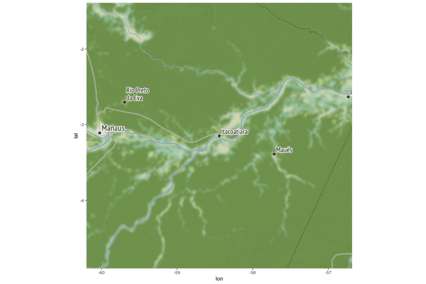

]

]

---

## Recursos para aprender a linguagem **R**

#### [Curso básico de introdução à linguagem R](https://intror.netlify.app)

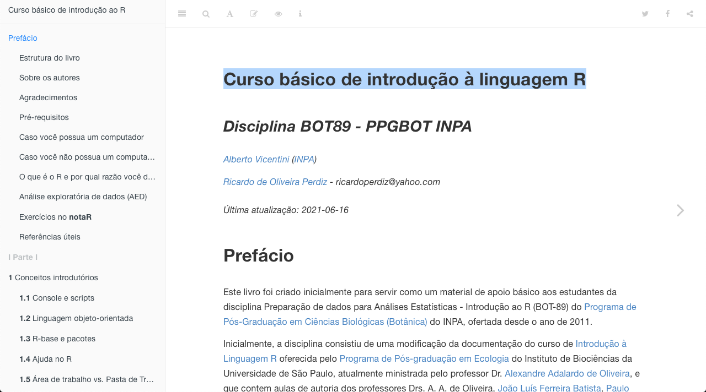

---

## Recursos para aprender linguagens de programação - [Grasshopper](https://grasshopper.app/pt_br/)


---
class: inverse, center, middle

## Mais recursos???

--

### Buscar, sempre! Google, Yahoo, etc.

---

### [R-bloggers](https://www.r-bloggers.com/)

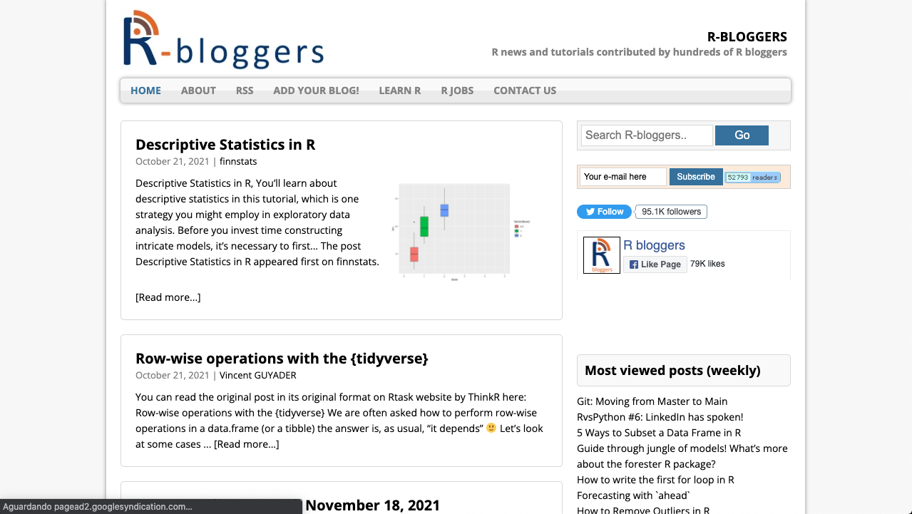

---

## Minicurso baseado na postagem abaixo:

[Obtendo dados e plotando mapas no R ](https://ricardoperdiz.com/post/2020_03_29_r-obtendo-plotando-dados/obtendo-dados-e-plotando-mapas-no-r-versao-3/)

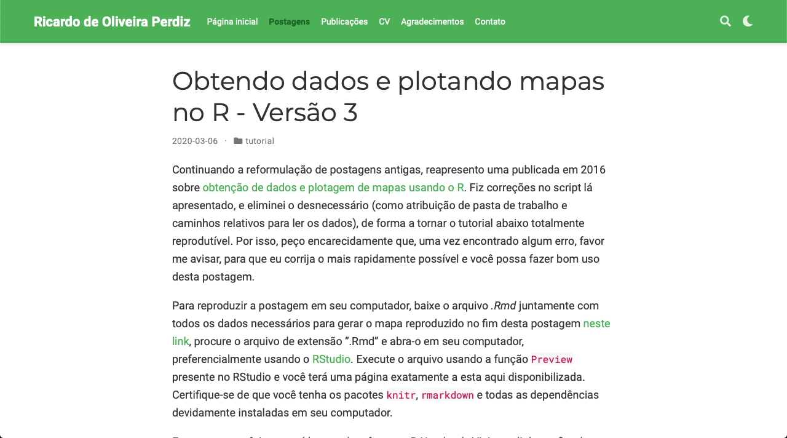

???

O tutorial é bem simples e visa a produção de um mapa de distribuição geográfica utilizando dados que abrangem a distribuição espacial de duas espécies de _[Burseraceae](https://en.wikipedia.org/wiki/Burseraceae)_, _Protium aracouchini_ (Aubl.) Marchand e _P. heptaphyllum_ (Aubl.) Marchand.  A primeira planta faz parte de um complexo de espécies informalmente denominado complexo _Protium aracouchini_, cuja sistemática e taxonomia vem sendo objeto de estudo em [meu doutorado](http://www.botanicaamazonica.wiki.br/labotam/doku.php?id=alunos:r.perdiz:projeto:inicio). A segunda espécie, _P. heptaphyllum_, é objeto de estudo de [Gabriel Damasco](https://ib.berkeley.edu/labs/fine/Site/Gabriel.html), colaborador do LABOTAM e aluno de doutorado na Universidade da Califórnia, Berkeley.

Os dados foram baixados do [herbário virtual do Jardim Botânico de Nova Iorque](http://sweetgum.nybg.org/science/vh/) que é onde trabalha o especialista em Burseraceae, Dr. Douglas Daly, e cuja coleção de espécimes e dados vêm sendo bem cuidada há algumas décadas. Para esta postagem, filtramos apenas os dados para as duas espécies citadas acima.

---

## Assuntos abordados

* (Instalar e) Carregar pacotes

* Importação de dados

* Checagem de dados

* Criação de variáveis

* Plotagem do mapa

---

## Instalando pacotes

```{r, echo=TRUE, eval=FALSE}
install.packages("maps")
```

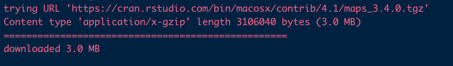

---

## Carregando os pacotes

```{r, echo=TRUE}
library("maps")
```

???

A postagem original faz uso dos pacotes _[maps](https://cran.r-project.org/web/packages/maps/maps.pdf)_ (para plotar o mapa), _[RColorBrewer](https://cran.r-project.org/web/packages/RColorBrewer/RColorBrewer.pdf)_ (paleta de cores), _[magrittr](https://cran.r-project.org/web/packages/magrittr/vignettes/magrittr.html)_ (pipe, ou `%>%`) e _[dplyr](https://cran.rstudio.com/web/packages/dplyr/vignettes/introduction.html)_ (manipulação de 'dataframes').

Neste minicurso, utilizaremos apenas o pacote `maps`, a fim de simplificar o aprendizado.  

---

### Intervalo


---
name: dados
## Importando os dados

Os dados estão reunidos em um arquivo chamado `dados.csv`, disponível em: [https://github.com/ricoperdiz/Tutorials/blob/master/R_make_a_map/dados.csv](https://github.com/ricoperdiz/Tutorials/blob/master/R_make_a_map/dados.csv).  

--

As informações estão separadas por tabulação e codificadas em UTF-8.  

--

Você pode baixar os dados direto da página do GitHub ou fazer uso do comando abaixo para ler diretamente os dados da rede.  

```{r, echo=TRUE, cache=TRUE}
protium <-
  read.table(
    file = url(
      "https://raw.githubusercontent.com/ricoperdiz/Tutorials/master/R_make_a_map/dados.csv"
    ),
    header = TRUE,
    as.is = TRUE,
    sep = '\t',
    dec = '.'
  )
```

---

## Destrinchando o `read.table`

> read.table() - Função básica para ler arquivos no R

--

### Argumentos

> file - Local do arquivo

--

> header - Tem cabeçalho ou não?

--

> as.is - Classes dos vetores. Deixa como está ou faz alguma conversão?

--

> sep - Separador de texto.

--

> dec - Separador de decimal.


---

## Checagem inicial dos dados

```{r}
DT::datatable(
  protium,
   fillContainer = TRUE, options = list(pageLength = 10)
  )
```


---

## Checagem e limpeza dos dados

* Existência de valores vazios; em caso positivo, devemos eliminá-los;

--

* Confiabilidade dos valores de latitude e longitude

--

* Valores duplicados?

???

Há valores vazios?  
Dados de Latitude e latitude, às vezes, por diversos fatores, há troca de sinais (negativos e positivos) ocasionando equívocos quanto à ocorrência exata da amostra. Se for percebido algo assim, é bom checar os dados e buscar corrigí-los.
Há valores duplicados?

---

## Um pouco de classe de objetos

Nossa tabela, após a importação, é chamada de `data.frame`.  

```{r, echo=TRUE}
class(protium)
```

```{r, echo=TRUE}
dim(protium)
```

---

## Acessando vetores em (ou partes de) um `data.frame`

> Utilizamos o "$"

```{r, echo=TRUE}
head(protium$recordedBy)
```

---

## Acessando vetores em (ou partes de) um `data.frame`

> Ou então colchetes, com o nome da coluna dentro de aspas, dentro dos colchetes

```{r, echo=TRUE}
head(protium[, "recordedBy"])
```

---

## Cria variáveis para plotar o mapa

--

### Nomes de espécies

```{r, echo=TRUE}
unique(protium$Species)
```


```{r, echo=TRUE}
spp <- unique(protium$Species)
spp
```

---

### Variáveis - Vetor de cores para utilizar no mapa

Para cada espécie, uma cor!

Vamos conhecer o famoso "if else", ou em português:

> Se ..., caso contrário ...

--

```{r, echo=TRUE}
ifelse(protium$Species == spp[1], 'red','black')
```

---

### Destrinchando o ifelse

```{r, echo=TRUE}
spp[1]
```


```{r, echo=TRUE}
head(protium$Species == spp[1], 10)
```

---

### Variáveis - Vetor de cores para utilizar no mapa

Para cada espécie, uma cor!


```{r, echo=TRUE}
cores.map <- ifelse(protium$Species == spp[1], 'red','black')
cores.map
```

---

class: inverse, center

# Fim do dia 1!

--

## Amanhã, dia 22 de outubro, continuaremos!

.pull-left[

]

.pull-right[
.LARGE[Dúvidas? Entrem em contato!]  
  .LARGE[GitHub: ricoperdiz]  
  .LARGE[Twitter: ricoperdiz]  
  .LARGE[ricardoperdiz.com]  
  .LARGE[ricoperdiz@gmail.com]  
]
