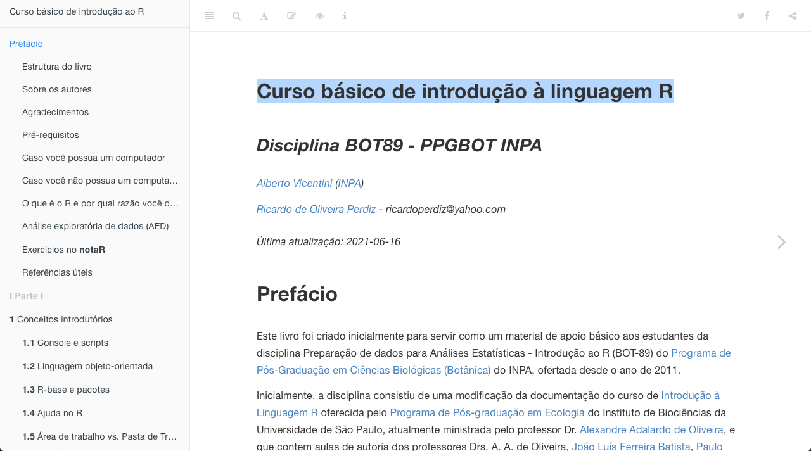
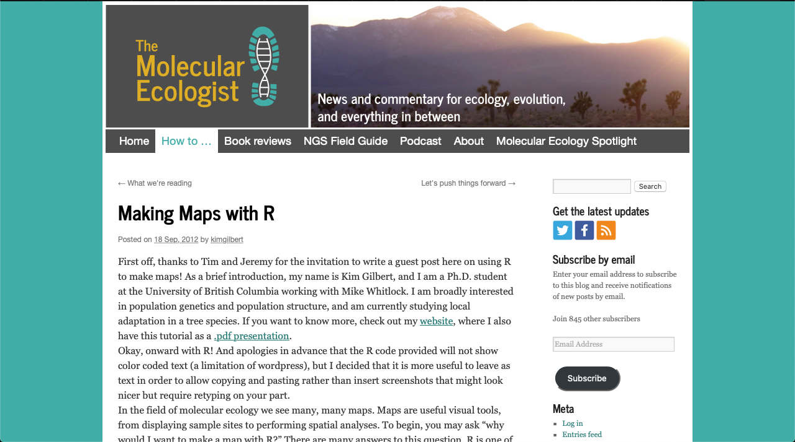
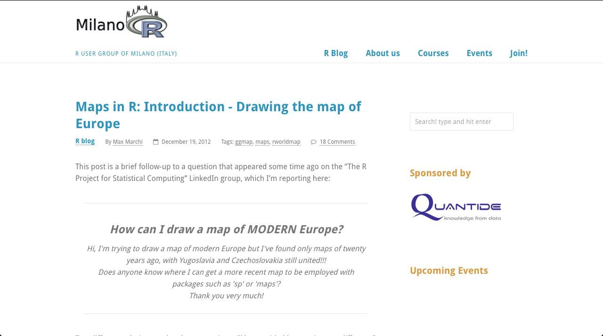
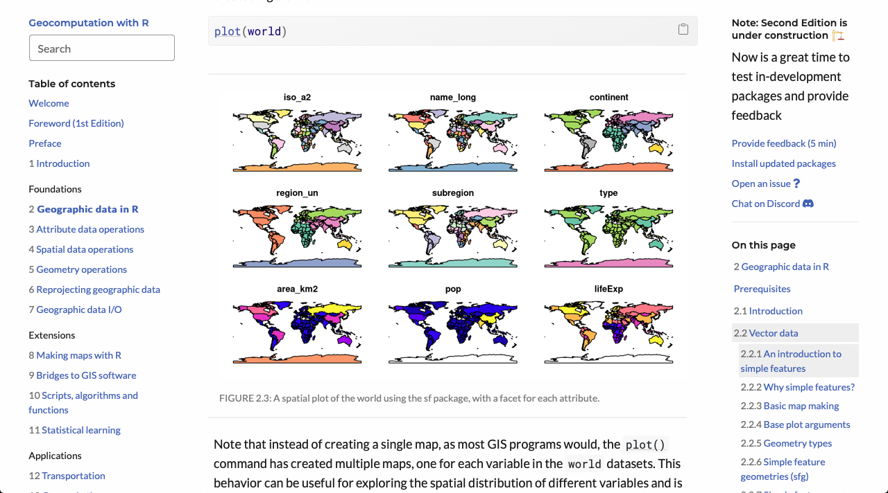
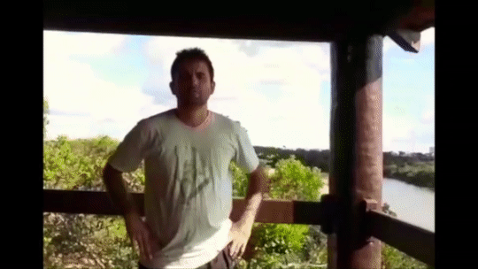

```{r setup, include=FALSE}
knitr::opts_chunk$set(echo = FALSE)
library("xaringanthemer")
# xaringan::summon_remark()
```

```{r xaringan-themer, include=FALSE, warning=FALSE}
# style_mono_accent(base_color = "#23395b")
style_duo_accent(primary_color = "#03A696", secondary_color = "#035AA6", header_font_google = google_font("Josefin Sans"), text_font_google   = google_font("Montserrat", "300", "300i"), code_font_google   = google_font("Fira Mono"), inverse_text_shadow = FALSE)
```

```{r xaringanExtra, echo=FALSE}
xaringanExtra::use_xaringan_extra(c("tile_view", "scribble"))
xaringanExtra::use_fit_screen()
xaringanExtra::use_panelset()
xaringanExtra::use_tachyons()
```

```{r, load_refs, include=FALSE}
# library("RefManageR")
# bib <- ReadBib("bib.bib", check = FALSE)
# pb <- function(key) {
#   TextCite(bib, key, .opts = list(
#     style = "markdown", 
#     hyperlink = "to.doc")
#     )
# }
```

layout: false

name: title
class: left, bottom
background-image: url("../figuras/title-slide.001.jpeg")
background-size: cover

.pull-left[

# .midlarge[.black[`r rmarkdown::metadata$title`]]

## .mid[.black[`r rmarkdown::metadata$subtitle`]]

#### .large[.black[`r rmarkdown::metadata$author` | `r rmarkdown::metadata$date`]]

]

<div class="cr cr-top cr-left cr-sticky cr-black">COVID19</div>

---


layout: true

<div class="cr cr-top cr-left cr-sticky cr-black">COVID19</div>

<a class="footer-link" href="https://github.com/ricoperdiz/minicurso-elaboracao-mapa-R">mapa-R</a>


---

```{r, include = FALSE, eval = FALSE}
library("metathis")
meta() %>%
  meta_general(
    description = "Minicurso simplificado para produção de mapas de distribuição de espécies utilizando o ambiente R",
    generator = "xaringan e remark.js"
  ) %>% 
  meta_name("github-repo" = "ricoperdiz/plantintelligence") %>% 
  meta_social(
    title = "Plant intelligence",
    # url = "https://rstd.io/sharing",
    image = "https://raw.githubusercontent.com/ricoperdiz/plantintelligence/main/share-card.png?token=ACSZLRFRBETCEJ65HB2PQKLAL72RG",
    image_alt = "Primeiro slide mostra um mapa com pontos de ocorrência de espécies do complexo Protium aracouchini (Aubl.) Marchand, um grupo de árvores pequenas que ocorre na América do Sul",
    og_type = "website",
    twitter_card_type = "summary_large_image"
  )
```

### Recapitulando o que vimos no dia 1


* Introdução básica ao R  

--

* [Tutorial](https://ricardoperdiz.com/post/2020_03_29_r-obtendo-plotando-dados/obtendo-dados-e-plotando-mapas-no-r-versao-3/)

--

  + Instalação e carregamento de pacote
  + Importação de dados
  + Indexação (acesso) de um `data.frame`
  + Variáveis - nomes de espécies
  + Variáveis - vetor de cores

---

## Um pequeno reforço! [Aulas em vídeo](https://intror.netlify.app/videos.html) no [curso básico de introdução à linguagem R](https://intror.netlify.app/)

.center[

]

---

## Um pequeno reforço! [Aulas em vídeo](https://intror.netlify.app/videos.html) no [curso básico de introdução à linguagem R](https://intror.netlify.app/)


---

### Variáveis - Cria um vetor de tamanho para cada espécie

Esse vetor é atribuído a uma coluna do conjunto de dados `protium`.  

*Protium heptaphyllum* possui uma distribuição mais ampla, por isso atribuo um tamanho menor pra ela.  

```{r, echo=TRUE}
protium$cex.p <- ifelse(protium$Species == spp[1], 1, 0.8)
```

---

### Variáveis - Vetor contendo dados de latitude e longitude em objetos separados

```{r, echo=TRUE}
lat <- protium$decimalLatitude
```


```{r, echo=TRUE}
long <- protium$decimalLongitude
```

---

### Variáveis - Vetores contendo amplitude de latitude e longitude

```{r, echo=TRUE}
# amplitude de lat e long para lat e long
y1 <- range(lat) + c(-1,1)
```


```{r, echo=TRUE}
x1 <- range(long) + c(-1,1)
```

---

### Variáveis - Vetor para os símbolos de cada espécie

Dúvidas, executar `?points` no R e verificar as formas de pontos atribuídas a cada número.  

```{r, echo=TRUE}
protium$pontos <- ifelse(protium$Species == spp[1], 21, 24)
```

---

### Variáveis - Vetor nomes de países da região Neotropical

```{r}
paises <- c('Brazil','Argentina','Peru','Paraguay','Ecuador','Chile','Uruguay','French Guiana','Suriname','Venezuela','Colombia','Guyana','Bolivia','Panama','Costa Rica')
```

---

## Plota o mapa - Mapa base

```{r, echo=TRUE, fig.height=6, fig.width=10}
maps::map(regions = paises, fill = F, xlim = x1, ylim = y1) #<<
```

---

## Pontos de ocorrencia de cada espécie

```{r, echo=TRUE, fig.height=6, fig.width=10}
maps::map(regions = paises, fill = F, xlim = x1, ylim = y1)
points(long,lat, pch = protium$pontos, col = cores.map, bg = cores.map, cex = protium$cex.p) #<<
```

---

## Coloca eixos das coordenadas

.pull-left[
```{r, eval=FALSE, echo=TRUE}
maps::map(regions = paises, fill = F, xlim = x1, ylim = y1)
points(long,lat, pch = protium$pontos, col = cores.map, bg = cores.map, cex = protium$cex.p)
map.axes() #<<
axis(side=4,las=1) #<<
axis(side=3,las=1) #<<
```
]

.pull-right[
```{r, echo=FALSE, fig.height=10, fig.width=12}
maps::map(regions = paises, fill = F, xlim = x1, ylim = y1)
points(long,lat, pch = protium$pontos, col = cores.map, bg = cores.map, cex = protium$cex.p)
map.axes() #<<
axis(side=4,las=1) #<<
axis(side=3,las=1) #<<
```
]


---

## Coloca escala do mapa

.pull-left[
```{r, eval=FALSE, echo=TRUE}
maps::map(regions = paises, fill = F, xlim = x1, ylim = y1)
points(long,lat, pch = protium$pontos, col = cores.map, bg = cores.map, cex = protium$cex.p)
map.axes()
axis(side=4,las=1)
axis(side=3,las=1)
par(cex=1, las=1) #<<
map.scale(max(long) - 12, ratio = F, cex = 1, metric = T) #<<
```
]

.pull-right[
```{r, echo=FALSE, fig.height=10, fig.width=12}
maps::map(regions = paises, fill = F, xlim = x1, ylim = y1)
points(long,lat, pch = protium$pontos, col = cores.map, bg = cores.map, cex = protium$cex.p)
map.axes()
axis(side=4,las=1)
axis(side=3,las=1)
par(cex=1, las=1) #<<
map.scale(max(long) - 12, ratio = F, cex = 1, metric = T) #<<
```
]


---

## Plota a linha do equador

.pull-left[
```{r, eval=FALSE, echo=TRUE}
maps::map(regions = paises, fill = F, xlim = x1, ylim = y1)
points(long,lat, pch = protium$pontos, col = cores.map, bg = cores.map, cex = protium$cex.p)
map.axes()
axis(side=4,las=1)
axis(side=3,las=1)
par(cex=1, las=1)
map.scale(max(long) - 12, ratio = F, cex = 1, metric = T)
abline(h=0,lwd=0.5,lty="dotted") #<<
```
]

.pull-right[
```{r, echo=FALSE, fig.height=10, fig.width=12}
maps::map(regions = paises, fill = F, xlim = x1, ylim = y1)
points(long,lat, pch = protium$pontos, col = cores.map, bg = cores.map, cex = protium$cex.p)
map.axes()
axis(side=4,las=1)
axis(side=3,las=1)
par(cex=1, las=1)
map.scale(max(long) - 12, ratio = F, cex = 1, metric = T)
abline(h=0,lwd=0.5,lty="dotted") #<<
```
]

---

## Nomeia a linha do equador

.pull-left[
```{r, eval=FALSE, echo=TRUE}
maps::map(regions = paises, fill = F, xlim = x1, ylim = y1)
points(long,lat, pch = protium$pontos, col = cores.map, bg = cores.map, cex = protium$cex.p)
map.axes()
axis(side=4,las=1)
axis(side=3,las=1)
par(cex=1, las=1)
map.scale(max(long) - 12, ratio = F, cex = 1, metric = T)
abline(h=0,lwd=0.5,lty="dotted")
text(x = max(long) - 1, y = 1,labels="Equador", cex=1, adj=c(1,0.5)) #<<
```
]

.pull-right[
```{r, echo=FALSE, fig.height=10, fig.width=12}
maps::map(regions = paises, fill = F, xlim = x1, ylim = y1)
points(long,lat, pch = protium$pontos, col = cores.map, bg = cores.map, cex = protium$cex.p)
map.axes()
axis(side=4,las=1)
axis(side=3,las=1)
par(cex=1, las=1)
map.scale(max(long) - 12, ratio = F, cex = 1, metric = T)
abline(h=0,lwd=0.5,lty="dotted")
text(x = max(long) - 1, y = 1,labels="Equador", cex=1, adj=c(1,0.5)) #<<
```
]

---

## Plota uma legenda


.pull-left[
```{r, eval=FALSE, echo=TRUE}
maps::map(regions = paises, fill = F, xlim = x1, ylim = y1)
points(long,lat, pch = protium$pontos, col = cores.map, bg = cores.map, cex = protium$cex.p)
map.axes()
axis(side=4,las=1)
axis(side=3,las=1)
par(cex=1, las=1)
map.scale(max(long) - 12, ratio = F, cex = 1, metric = T)
abline(h=0,lwd=0.5,lty="dotted")
legend(max(long) - 16 , max(lat),legend = spp, pch = unique(protium$pontos), pt.bg = unique(cores.map), cex = 0.8, x.intersp = 0.8, text.font = 3) #<<
```
]

.pull-right[
```{r, echo=FALSE, fig.height=10, fig.width=12}
maps::map(regions = paises, fill = F, xlim = x1, ylim = y1)
points(long,lat, pch = protium$pontos, col = cores.map, bg = cores.map, cex = protium$cex.p)
map.axes()
axis(side=4,las=1)
axis(side=3,las=1)
par(cex=1, las=1)
map.scale(max(long) - 12, ratio = F, cex = 1, metric = T)
abline(h=0,lwd=0.5,lty="dotted")
legend(max(long) - 16 , max(lat),legend = spp, pch = unique(protium$pontos), pt.bg = unique(cores.map), cex = 0.8, x.intersp = 0.8, text.font = 3) #<<
```
]

---

## E se eu quiser salvar o mapa em um `pdf`, como eu faço?

.pull-left[
```{r, eval=FALSE, echo=TRUE}
pdf('meu_mapa_complexo_protium_aracouchini_e_heptaphyllum.pdf',height=8,width=10) #<<
maps::map(regions = paises, fill = F, xlim = x1, ylim = y1)
points(long,lat, pch = protium$pontos, col = cores.map, bg = cores.map, cex = protium$cex.p)
map.axes()
axis(side=4,las=1)
axis(side=3,las=1)
par(cex=1, las=1)
map.scale(max(long) - 12, ratio = F, cex = 1, metric = T)
abline(h=0,lwd=0.5,lty="dotted")
text(x = max(long) - 1, y = 1,labels="Equador", cex=1, adj=c(1,0.5))
legend(max(long) - 16 , max(lat),legend = spp, pch = unique(protium$pontos), pt.bg = unique(cores.map), cex = 0.8, x.intersp = 0.8, text.font = 3)
dev.off() #<<
```
]


.pull-right[
```{r, echo=FALSE, fig.height=10, fig.width=12}
pdf('meu_mapa_complexo_protium_aracouchini_e_heptaphyllum.pdf',height=8,width=10) #<<
maps::map(regions = paises, fill = F, xlim = x1, ylim = y1)
points(long,lat, pch = protium$pontos, col = cores.map, bg = cores.map, cex = protium$cex.p)
map.axes()
axis(side=4,las=1)
axis(side=3,las=1)
par(cex=1, las=1)
map.scale(max(long) - 12, ratio = F, cex = 1, metric = T)
abline(h=0,lwd=0.5,lty="dotted")
text(x = max(long) - 1, y = 1,labels="Equador", cex=1, adj=c(1,0.5))
legend(max(long) - 16 , max(lat),legend = spp, pch = unique(protium$pontos), pt.bg = unique(cores.map), cex = 0.8, x.intersp = 0.8, text.font = 3)
dev.off() #<<
```
]

---
class: inverse, center, middle
## Mais referências!


---

### [Curso básico de introdução ao R](https://intror.netlify.app)

.center[

]

---

### [Making maps with R](http://www.molecularecologist.com/2012/09/making-maps-with-r/)

.center[

]

---

### [Maps in R: Introduction](http://www.milanor.net/blog/?p=534)

.center[

]

---

### [Geocomputation with R](https://geocompr.robinlovelace.net/index.html)

.center[

]

---
class: inverse, center

# Grato!

.pull-left[

]

.pull-right[
.LARGE[Dúvidas? Entrem em contato!]  
  .LARGE[GitHub: ricoperdiz]  
  .LARGE[Twitter: ricoperdiz]  
  .LARGE[ricardoperdiz.com]  
  .LARGE[ricoperdiz@gmail.com]  
]

---

## Checagem de dados

```{r, eval=FALSE, include=FALSE}
# Em nosso caso, devemos verificar:
  
#   + existência de valores vazios; em caso positivo, devemos eliminá-los;
# + confiabilidade dos valores de latitude e longitude, às vezes, por diversos fatores, há troca de sinais (negativos e positivos) ocasionando equívocos quanto à ocorrência exata da amostra. Se for percebido algo assim, é bom checar os dados e buscar corrigí-los.

# une os dados e passa para a proxima acao
dad <- 
  rbind(aracouch,heptaphy) %>%
  #elimina os registros vazios de coletor
  filter(recordedBy != '') %>%
  #elimina os registros sem lat ou long
  filter(decimalLatitude != '' | decimalLongitude != '') %>%
  #filtra apenas os especimes identificados pelo especialista da família Burseraceae
  filter(identifiedBy == 'D. C. Daly')

#ha registros duplicados
#busca-se entao apenas os dados unicos
#limpa os dados de coletor e numero para poder criar um identificador
#limpeza consiste em eliminar '.', espacos vazios, apostrofe e '_' duplos
dad$recordedBy <-
  gsub('\\.', '_', dad$recordedBy) %>%
  gsub(' ', '_', .) %>%
  gsub("'", '_', .) %>%
  gsub('__', '_', .)

#faz-se o mesmo para os numeros de coleta
dad$recordNumber <- 
  gsub('/','_', dad$recordNumber) %>%
  gsub(' ', '_', .) %>%
  gsub('\\.', '_', .)

#cria o identificador de coleta e especie
dados <- dad %>%
  mutate( ID = paste(recordedBy,recordNumber, sep = '_'), Species = paste('Protium', specificEpithet, sep = ' '))
dados$ID <- gsub('__','_',dados$ID)


#quem sao os dados unicos
unicos <- unique(dados$ID)

#agora filtra os dados unicos no dataframe, eliminando os duplicados
#faz-se uso da funcao match para obter esse resultado
prot <- 
  match(unicos, dados$ID) %>%
  dados[.,]
#verifica a cobertura de lat e long para ver se estao dentro
# dos limites da America do Sul
lat <- range(prot$decimalLatitude)
long <- range(prot$decimalLongitude) #aqui tem algo estranho
#percebe-se aqui que ha valores que caem fora da Am Sul
#limite e pouco mais de -80
head(sort(prot$decimalLongitude))
#devemos eliminar
protium <-
  prot %>%
  filter(decimalLongitude > -80)

```

